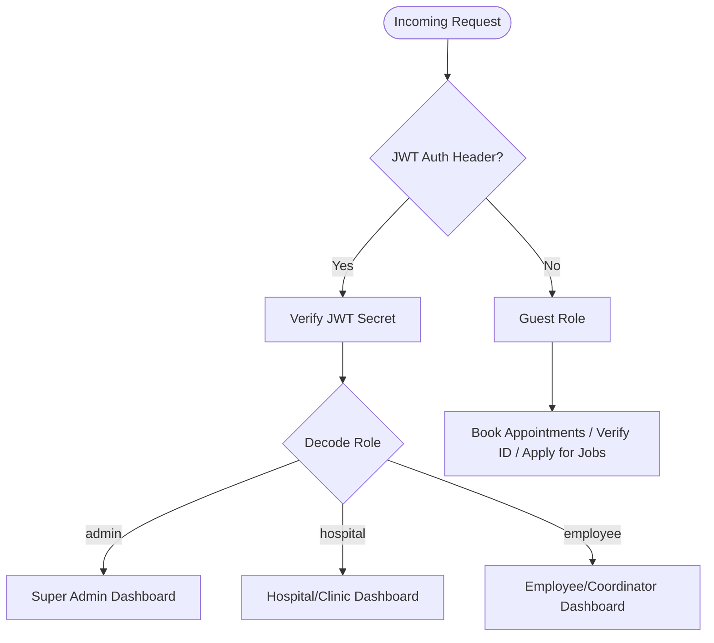

# Aagaj Foundation Web Portal

A production-grade, full-stack digital web portal built for **Aagaj Foundation**, a registered non-profit trust dedicated to empowering women, providing healthcare accessibility, and creating self-employment opportunities across communities
A production-grade, full-stack digital web portal built for **Aagaj Foundation**, a registered non-profit trust dedicated to community empowerment, women's training (Silayi Prasikshan), healthcare accessibility (Swasthya Suraksha Network), and self-employment (Swarojgaar groups).

This repository comprises a modern React-based single-page application (frontend) and a Node.js/Express application (REST API server) powered by MongoDB.

---

## 🚀 Key Modules & Features

### 1. Swasthya Suraksha Network (Healthcare & Appointments)
* **Beneficiary Search & Validation**: Quick search and validation of custom Health IDs (format: `MC-XXXXXX`).
* **Interactive Doctor Appointments**: Booking engine that routes patient requests to partner hospitals/clinics by specialty, department, symptoms, and attachments.
* **Flexible Visit Options**: Supports both **Physical Clinic Visits** and **Teleconsultation (Telemedicine)** bookings.
* **Success Receipts**: Generates premium print-ready appointment receipt overlays displaying critical patient/doctor info.

### 2. Health ID Card Generator & Exporter
* **Dynamic PDF & PNG Exporters**: Compiles digital patient details, barcode mapping, passport-size photographs, issue date, and validation metadata into a print-friendly ID card.
* **Front & Back Download**: Uses `html2canvas-pro` to capture clean, high-resolution graphic cards directly on the client browser.

### 3. Career & Job Applications Portal
* **Structured Application Forms**: Applicants can apply for specific NGO posts (e.g., *District Coordinator*, *Block Coordinator*, *Panchayat Coordinator*, or *Field Executive*).
* **Payment Integration**: Seamless checkout flow backed by **Razorpay** for handling application registration fees.
* **Automated Email Confirmations**: Dynamically notifies selected candidates with structured HTML emails detailing their post, date of joining (DOJ), and post location.

### 4. Silayi Prasikshan & Swarojgaar Registers
* **Silayi Prasikshan (Stitching & Tailoring Training)**: Registers and validates women beneficiaries enrolled in community tailoring centers.
* **Swarojgaar (Self-Employment Groups)**: Tracks community-led joint enterprise groups, group leaders, and validation statuses.
* **Dual-Stage Lookup**: Secure verification using mobile numbers or registration keys before details are fetched.

---

## 🔑 Role-Based Access Control (RBAC)

The application implements strict Role-Based Access Control (RBAC) via JWT payload signatures and express middleware.



### Roles and Permissions Matrix

| Feature / Action | Guest / Public | Employee (Coordinators) | Hospital Partner | Super Admin |
| :--- | :---: | :---: | :---: | :---: |
| **Book Appointment / Verify Health Card** | ✅ | ✅ | ✅ | ✅ |
| **Apply for NGO Jobs / Apply for Health ID** | ✅ | ✅ | ✅ | ✅ |
| **Log Attendance (Clock In/Out + Heartbeat)** | ❌ | ✅ | ❌ | ❌ |
| **Register Silayi & Swarojgaar Beneficiaries** | ❌ | ✅ | ❌ | ✅ |
| **Check in Patients & Upload Treatment Bills** | ❌ | ❌ | ✅ | ✅ |
| **Add/Delete/Edit Patient Bills & Receipt Attachments**| ❌ | ❌ | ✅ | ✅ |
| **Generate/Reset Partner Hospital Credentials** | ❌ | ❌ | ❌ | ✅ |
| **View Audit Trails & Global Transaction Logs** | ❌ | ❌ | ❌ | ✅ |
| **Manage Carousel Media & Global App Statistics** | ❌ | ❌ | ❌ | ✅ |

#### 1. Super Admin (`admin`)
* Full root access.
* Ability to register, approve, edit, and reset passwords for partner hospitals/clinics.
* Visualizes global transaction streams, analytics, and handles user management.
* Oversees the global auditing log console.

#### 2. Hospital Partner (`hospital`)
* Scoped access limited to the hospital's unique identifier (`uniqueId`).
* Records patient intake logs, checks in beneficiaries, and generates billing records for treatments.
* Supports uploading receipts/bills, editing bill amounts, or deleting incorrect entries.

#### 3. Employee / Coordinator (`employee`)
* Includes designations like *District*, *Block*, and *Panchayat Coordinators*.
* Can submit beneficiary health cards, silayi registrations, and swarojgaar records.
* **Realtime Software Attendance**: Clock-in and Clock-out tool with geolocation/work mode selection. Active work tracking monitors the session via heartbeat pings to calculate true software usage time.

#### 4. Guest / Public (`guest`)
* Public endpoints allowing users to submit appointment requests, verify cards, apply for jobs, and trigger secure OTP verifications.

---

## 💬 Message & Gateway Integrations

The system is equipped with robust SMS, authentication, and payment integrations.

### 1. SMS & OTP Integrations
The application features a plug-and-play **SMS Gateway Service** (`server/src/services/smsService.js`) with support for three major providers:
* **Fast2SMS (India)**: Ideal for quick OTP routing via Indian DLT templates.
* **MSG91 (Enterprise India)**: Supports both direct OTP templates and the **MSG91 Auth Widget API** (`/api/v5/widget/sendOtp`) for headless verification.
* **Twilio (Global)**: Integrated for international SMS and WhatsApp alert notifications upon booking approvals.

> [!TIP]
> **Developer Fallback Mode**: If no API keys are provided in the environment variables, the system automatically falls back to logging OTP codes directly to the server console (`dev_mode`). This prevents testing workflows from breaking during offline local development.

### 2. Payment Integration (Razorpay)
* Processes application fees for coordinator roles.
* Integrates webhooks (`/api/payments/webhook`) to handle payment confirmation events, saving application files and writing payment logs securely to MongoDB.

---

## 📝 System Logging & Auditing (How Logs Work)

To maintain accountability and security, the system utilizes a customized **Audit Log Middleware** (`server/src/middleware/auditTrail.js`).

### How Audit Trail Logging Operates:
1. **Request Interception**: The middleware intercepts all data-modifying write operations (`POST`, `PUT`, `PATCH`, `DELETE`).
2. **Actor Resolution**: It decodes the JWT Authorization header on the fly to determine who made the request (captures `actor.id`, `actor.role`, and `actor.uniqueId`).
3. **Data Redaction & Truncation**:
   * Sensitive parameters (such as `password`, `hashPass`, `token`, `authorization`, and key secrets) are automatically replaced with `[REDACTED]` to prevent leak of credentials.
   * Super-long payload texts are truncated to `500...[TRUNCATED]` to preserve database storage.
4. **Context Capture**: It logs details like HTTP Method, Target URL path, Response status code, IP Address, User-Agent, and exact query parameters/body payloads.
5. **Unique Request Tracking**: A unique 8-character hexadecimal `requestId` is stamped on the incoming request to correlate actions across server logs.
6. **Querying Audit Logs**: Super Admins can monitor, search, and filter these logs dynamically through:
   `GET /api/hospital-admin-system/admin/audit-logs?role=employee&action=POST&fromDate=2026-08-01`

---

## 📂 Repository Structure

```text
Aagaz-Conversion/
├── client/                     # React Frontend Application (Vite)
│   ├── src/
│   │   ├── api/                # API Client Layer (Axios interceptors & endpoints)
│   │   │   ├── attendanceApi.js# Employee Clock-in/Clock-out & pings
│   │   │   └── userApi.js      # User, Applicants, & Beneficiary requests
│   │   ├── components/         # Shared UI components
│   │   │   └── Navbar.jsx      # Dynamic navigation routing based on roles
│   │   ├── context/            # AuthContext & Session management
│   │   └── pages/              # View screens (Dashboards, Booking, Verification)
│   │       ├── AdminDashboard.jsx
│   │       ├── EmployeeDashboard.jsx
│   │       ├── HospitalDashboard.jsx
│   │       └── VerifyHealthCard.jsx
│   └── package.json
│
├── server/                     # Node.js/Express Backend Server
│   ├── src/
│   │   ├── config/             # DB Connection (MongoDB Atlas) & Server configs
│   │   ├── middleware/         # Audit Log, JWT Auth, & Validation Guards
│   │   ├── models/             # Mongoose Schemas (Attendance, HealthCard, OTPs, AuditLogs)
│   │   ├── routes/             # REST Endpoints (Hospital, Attendance, Payments)
│   │   ├── services/           # External API Wrappers (MSG91, Twilio, Fast2SMS, Email)
│   │   └── app.js              # Server entry point & global configurations
│   └── package.json
└── README.md
```

---

## ⚙️ Environment Configurations

### Server Environment Setup (`server/.env`)
Create a `.env` file inside the `server/` directory and configure the variables as shown in `server/.env.example`:
```env
PORT=5000
NODE_ENV=development
MONGO_URI=your_mongodb_connection_string
JWT_SECRET=your_jwt_secret_token
FRONTEND_URL=http://localhost:5173

# Razorpay credentials
RAZORPAY_KEY_ID=your_razorpay_key_id
RAZORPAY_KEY_SECRET=your_razorpay_key_secret

# SMS Provider Selection: 'fast2sms' | 'msg91' | 'twilio' (leave empty for Dev mode console logs)
SMS_PROVIDER=msg91

# FAST2SMS Configurations
FAST2SMS_API_KEY=your_fast2sms_api_key

# MSG91 Configurations
MSG91_AUTH_KEY=your_msg91_auth_key
MSG91_WIDGET_ID=your_msg91_widget_id
MSG91_TEMPLATE_ID=your_msg91_otp_template_id

# Twilio Configurations (Global SMS / WhatsApp)
TWILIO_ACCOUNT_SID=your_twilio_sid
TWILIO_AUTH_TOKEN=your_twilio_auth_token
TWILIO_PHONE_NUMBER=your_twilio_phone_number
```

### Client Environment Setup (`client/.env`)
Create a `.env` file inside the `client/` directory:
```env
VITE_API_URL=http://localhost:5000
```

---

## 💻 Local Installation & Setup

### Step 1: Run the Express Backend Server
```bash
# Navigate to the server folder
cd server

# Install node dependencies
npm install

# Start backend server in development mode
npm run dev
```

### Step 2: Run the React Frontend Client
```bash
# Open a new terminal and navigate to the client folder
cd client

# Install node dependencies
npm install

# Start Vite hot-reloading dev server
npm run dev
```
Navigate to [http://localhost:5173](http://localhost:5173) in your browser.

---

## 📦 Production Builds

To compile the React bundle for production hosting:
```bash
cd client
npm run build
```
The optimized production bundle will be generated under the `client/dist` directory.
