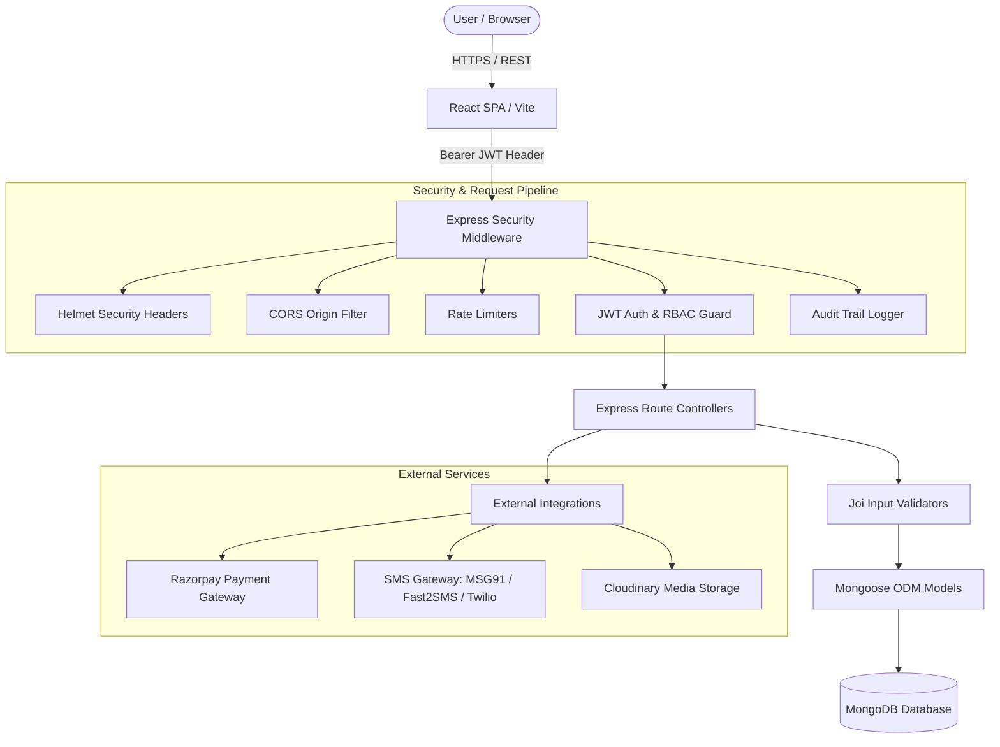

# Aagaj Foundation — Full-Stack Management & Healthcare Platform

## Overview

**Aagaj Foundation** is a real-world, production-deployed full-stack digital management and healthcare platform engineered for a registered non-profit trust in India. The platform digitizes community health networks, skill development programs, self-employment initiatives, field employee operations, and administrative oversight.

The system addresses critical operational challenges in non-profit management, including manual beneficiary tracking, fragmented healthcare appointment routing, insecure employee profile access, field camp registration management, and audit logging. Designed for administrative leaders, partner healthcare facilities, field coordinators, and public citizens, it unifies multi-role workflows into a single secure platform.

Built as a decoupled full-stack application, the platform features a modern React single-page application (SPA) powered by Vite on the frontend and an Express.js REST API server backed by MongoDB on the backend.

---

## Engineering Highlights

- Designed and implemented a decoupled React + Express full-stack architecture.
- Implemented JWT-based authentication with server-side RBAC.
- Built role-specific workflows for administrators, employees/coordinators, hospital partners, and public users.
- Integrated MongoDB using Mongoose for structured application data.
- Implemented API rate limiting, security headers, CORS controls, input validation, and audit logging.
- Integrated third-party services for payments, OTP/SMS, email notifications, and media storage.
- Implemented sensitive-data redaction and protected access to employee and beneficiary information.
- Added production-oriented error handling and environment-based secret management.

---

## Key Features

### Healthcare & Beneficiary Management
- **Swasthya Suraksha Network**: Dynamic lookup and verification of custom Health IDs (format: `MC-XXXXXX`).
- **Doctor Appointments**: Multi-department booking engine supporting physical clinic visits and teleconsultations with hospital/specialty routing.
- **Digital Health Card Generator**: Client-side graphic rendering (`html2canvas-pro`) and PDF/PNG generation for patient ID cards.
- **Hospital Intake & Billing**: Partner hospitals can log patient intake, manage treatment bills, and upload digital receipt attachments.

### Employee & Administration Management
- **Role-Based Access Control (RBAC)**: Fine-grained server-side authorization separating Super Admins, Hospital Partners, and District/Block Coordinators.
- **Real-Time Attendance**: Clock-in and clock-out system with work mode selection (Office/Field), geolocation tracking, and active session heartbeat pings.
- **Field Scheme Registers**: Management of *Silayi Prasikshan* (stitching and tailoring training) and *Swarojgaar* (self-employment groups) candidate registrations.
- **Candidate Application Portal**: Job application engine for NGO post applicants with role-specific tracking and dynamic email notifications.

### User & Public Features
- **Public Appointment Booking**: Direct booking interface for healthcare appointments with instant confirmation receipts.
- **Health Card Verification**: Public card validation tool protected by secure OTP authentication.
- **Dynamic Content Showcase**: Live carousel banners and public notice board updates managed via backend API.

### Payments & Communication Services
- **Payment Processing**: Integrated **Razorpay** checkout for candidate registration fees and donations with server-side signature verification.
- **Multi-Provider SMS & OTP**: Unified SMS service wrapper supporting **Fast2SMS** (DLT OTP), **MSG91** (Widget & Template API), and **Twilio** (Global SMS).
- **Automated Email Notifications**: HTML transactional emails for candidate selection, appointment bookings, and partner registrations.

### Monitoring & Security Audit
- **Automated Audit Logging**: Middleware-driven audit trail capturing write operations (`POST`, `PUT`, `PATCH`, `DELETE`) with request correlation IDs.
- **Sensitive Data Redaction**: Automatic parameter sanitization replacing passwords, OTPs, Aadhaar numbers, and API tokens with `[REDACTED]`.
- **System Telemetry & Reports**: Global applicant counters, attendance analytics, and transaction logs accessible via Super Admin dashboard.

---

## User Roles & RBAC

All protected resources enforce authorization **server-side** using verified JWT claims (`req.user.role`). Client-side route guards complement backend authorization to present role-specific UI components.

| Role | Responsibilities / Access Scope |
| :--- | :--- |
| **Super Admin** (`admin`) | Complete system access. Manages partner hospital credentials, approves applicant candidates, views global audit logs, and monitors overall foundation metrics. |
| **Hospital Partner** (`hospital`) | Scoped strictly to the facility's unique ID (`uniqueId`). Registers patient intake, creates treatment bills, edits billing entries, and attaches treatment receipts. |
| **Employee / Coordinator** (`employee`) | Covers District, Block, and Panchayat Coordinators. Submits beneficiary health cards, registers Silayi/Swarojgaar groups, logs daily attendance, and manages field camp data. |
| **User / Citizen** (`public`) | Unauthenticated public access. Can submit doctor appointments, verify health cards via OTP, apply for NGO career opportunities, and view public information. |

---

## System Architecture



The application uses a clean, decoupled architecture. Client requests pass through a security middleware stack (Helmet headers, CORS restrictions, rate limiters, JWT signature validation, and audit logging) before reaching Express route controllers. Data persistence is managed through Mongoose ODM schemas connected to MongoDB, while external operations (payments, SMS notifications, and file storage) are handled by dedicated service wrappers.

---

## Technology Stack

| Layer | Technology |
| :--- | :--- |
| **Frontend Framework** | React 18, Vite |
| **UI & Styling** | Custom CSS, TailwindCSS, Lucide React (Icons) |
| **Client Libraries** | React Router DOM, Axios, html2canvas-pro, Canvas-Confetti |
| **Backend Runtime** | Node.js, Express.js |
| **Database** | MongoDB, Mongoose ODM |
| **Authentication** | JSON Web Tokens (`jsonwebtoken`), Bcrypt.js |
| **Security** | Helmet, Express-Rate-Limit, Custom Audit Logger, Joi Validation |
| **Payment Gateway** | Razorpay SDK |
| **Messaging & OTP** | MSG91 API, Fast2SMS API, Twilio SDK, Nodemailer |
| **File Storage** | Cloudinary API, Multer, Local Uploads Static Middleware |
| **PDF Generation** | PDFKit |

---

## Security & Production Hardening

The repository incorporates standard backend security controls:

- **JWT Authentication**: Secured with server-side signature validation using environment-configured secrets. Hardcoded token bypass strings (such as `employee-session`) have been completely removed.
- **Server-Side RBAC Enforcement**: Role checks (`admin`, `employee`, `hospital`) are enforced at the API route layer rather than relying on client-side UI visibility.
- **IDOR Prevention**: Profile endpoints (`/api/employee/profile`) and attendance queries (`/my-attendance`) enforce token identity (`req.user.email`) for non-admin users, preventing unauthorized query parameter manipulation.
- **Response Sanitization**: Authentication and user endpoints return sanitized data transfer objects (`safeUser`), preventing password hashes, OTP secrets, or internal database metadata from leaking in API payloads.
- **PII Protection**: Sensitive fields such as Aadhaar numbers and contact information are restricted to authorized endpoints and masked in public views.
- **Audit Logging with Redaction**: Data-modifying requests (`POST`, `PUT`, `PATCH`, `DELETE`) are logged to MongoDB. Sensitive fields (`password`, `emp_password`, `otp`, `aadhaar`, `razorpay_signature`) are automatically replaced with `[REDACTED]`.
- **API Rate Limiting**: Multi-tiered rate limiters protect public APIs, authentication login attempts, and payment order creation endpoints against brute-force attacks.
- **Security Headers & CORS**: Uses `helmet` for cross-origin security headers and environment-driven CORS configuration (`ALLOWED_ORIGINS`).
- **Input Validation**: Critical POST/PUT inputs are validated against Joi schemas and MongoDB ObjectId checks before reaching database execution layers.
- **Secrets Management**: All API keys, tokens, database URIs, and credentials are read strictly from environment variables (`.env`). `.env` files are explicitly excluded in `.gitignore`.

---

## Project Structure

```text
Colg-proj/
├── client/                     # React Frontend Single-Page Application
│   ├── src/
│   │   ├── api/                # Axios API service callers (attendanceApi, userApi, etc.)
│   │   ├── components/         # Shared UI components & Navbar
│   │   ├── context/            # AuthContext & Session state management
│   │   ├── pages/              # Views (Dashboards, Booking, Verification, Forms)
│   │   ├── utils/              # Client utilities & card export logic
│   │   ├── App.jsx             # Main client routes & RBAC guards
│   │   └── main.jsx            # React application entry point
│   ├── index.html              # HTML shell template
│   ├── package.json            # Client dependencies & Vite scripts
│   └── vite.config.js          # Vite bundler configuration
│
├── server/                     # Node.js / Express REST API Server
│   ├── src/
│   │   ├── config/             # Cloudinary & MongoDB connection modules
│   │   ├── middleware/         # Auth guard, Audit logger, Request validator, Upload guard
│   │   ├── models/             # Mongoose schemas (Admin, Employee, HealthCard, AuditLog, etc.)
│   │   ├── routes/             # REST route modules (Hospital, Attendance, Payments, etc.)
│   │   ├── services/           # Gateway wrappers (SMS, Email, OTP)
│   │   ├── utils/              # Joi validation schemas & helper functions
│   │   └── app.js              # Server entry point, middleware stack & API routes
│   ├── .env.example            # Environment variable template (no real secrets)
│   ├── package.json            # Server dependencies & scripts
│   └── vercel.json             # Vercel deployment configuration
│
├── .gitignore                  # Git ignore rule definitions
└── README.md                   # Technical documentation
```

---

## Environment Setup

1. Create a `.env` file in the `server/` directory based on `.env.example`:

```env
PORT=5000
NODE_ENV=development
MONGO_URI=mongodb://localhost:27017/aagaj
JWT_SECRET=your_jwt_secret_key_here
FRONTEND_URL=http://localhost:5173

# RAZORPAY CONFIGURATION
RAZORPAY_KEY_ID=your_razorpay_key_id
RAZORPAY_KEY_SECRET=your_razorpay_key_secret

# SMS GATEWAY CONFIGURATION ('fast2sms' | 'msg91' | 'twilio')
SMS_PROVIDER=fast2sms
FAST2SMS_API_KEY=your_fast2sms_api_key
MSG91_AUTH_KEY=your_msg91_auth_key
TWILIO_ACCOUNT_SID=your_twilio_sid
TWILIO_AUTH_TOKEN=your_twilio_auth_token
```

2. Create a `.env` file in the `client/` directory:

```env
VITE_API_URL=http://localhost:5000
```

---

## Local Development & Installation

### 1. Run Backend Server

```bash
cd server
npm install
npm start
```

### 2. Run Frontend Client

```bash
cd client
npm install
npm run dev
```

Open [http://localhost:5173](http://localhost:5173) in your browser.

---

## Build & Verification

To generate the frontend production distribution bundle:

```bash
cd client
npm run build
```

The compiled assets will be output to `client/dist/`.
